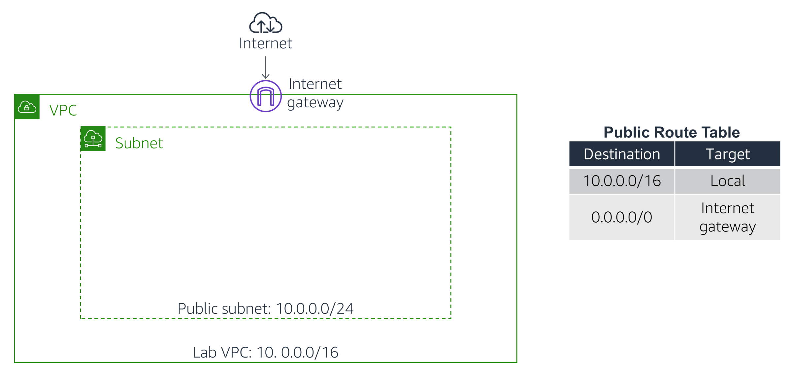

# AWS CloudFormation Automation Lab

<div align="center">
  
</div>

## Overview


---
⚠️ **Attention:**
- All the tasks will be completed via the command line using AWS CLI. Ensure you have the necessary permissions. [Install AWS CLI](https://docs.aws.amazon.com/cli/latest/userguide/getting-started-install.html)
- Charges may apply for completing this lab. [AWS Pricing](https://aws.amazon.com/pricing/)
---

## 1. Create the YAML Template
- Create a file called `task1.yml` with the following YAML content:
```yaml
AWSTemplateFormatVersion: '2010-09-09'
Description: 'VPC with a Public Subnet and an Internet Gateway'

Resources:
  LabVPC:
    Type: 'AWS::EC2::VPC'
    Properties: 
      CidrBlock: '10.0.0.0/16'
      EnableDnsSupport: true
      EnableDnsHostnames: true
      Tags:
        - Key: 'Name'
          Value: 'LabVPC'

  PublicSubnet:
    Type: 'AWS::EC2::Subnet'
    Properties: 
      VpcId: !Ref LabVPC
      CidrBlock: '10.0.0.0/24'
      MapPublicIpOnLaunch: true
      AvailabilityZone: !Select [ 0, !GetAZs ]
      Tags:
        - Key: 'Name'
          Value: 'PublicSubnet'

  InternetGateway:
    Type: 'AWS::EC2::InternetGateway'
    Properties: 
      Tags:
        - Key: 'Name'
          Value: 'LabIGW'

  AttachGateway:
    Type: 'AWS::EC2::VPCGatewayAttachment'
    Properties: 
      VpcId: !Ref LabVPC
      InternetGatewayId: !Ref InternetGateway

  PublicRouteTable:
    Type: 'AWS::EC2::RouteTable'
    Properties: 
      VpcId: !Ref LabVPC
      Tags:
        - Key: 'Name'
          Value: 'PublicRouteTable'

  PublicRoute:
    Type: 'AWS::EC2::Route'
    Properties: 
      RouteTableId: !Ref PublicRouteTable
      DestinationCidrBlock: '0.0.0.0/0'
      GatewayId: !Ref InternetGateway

  PublicSubnetRouteTableAssociation:
    Type: 'AWS::EC2::SubnetRouteTableAssociation'
    Properties: 
      SubnetId: !Ref PublicSubnet
      RouteTableId: !Ref PublicRouteTable
```
---
## 2. Create the Stack Using AWS CLI
- Create the CloudFormation stack:
```bash
aws cloudformation create-stack \
  --stack-name LabVPCStack \
  --template-body file://task1.yml \
  --capabilities CAPABILITY_NAMED_IAM  
```
---
## 3. Check Stack Status
- To check the progress of the stack creation:
```bash
aws cloudformation describe-stacks --stack-name LabVPCStack
```
- Look for the **StackStatus** field. When it shows **CREATE_COMPLETE**, the stack creation is finished.
---
## 4. View Created Resources
- Once the stack is created, you can list the resources:
```bash
aws cloudformation describe-stack-resources --stack-name LabVPCStack
```
---
## 5. Deleting the Stack
- If you need to delete the stack and remove all associated resources:
```bash
aws cloudformation delete-stack --stack-name LabVPCStack
```
