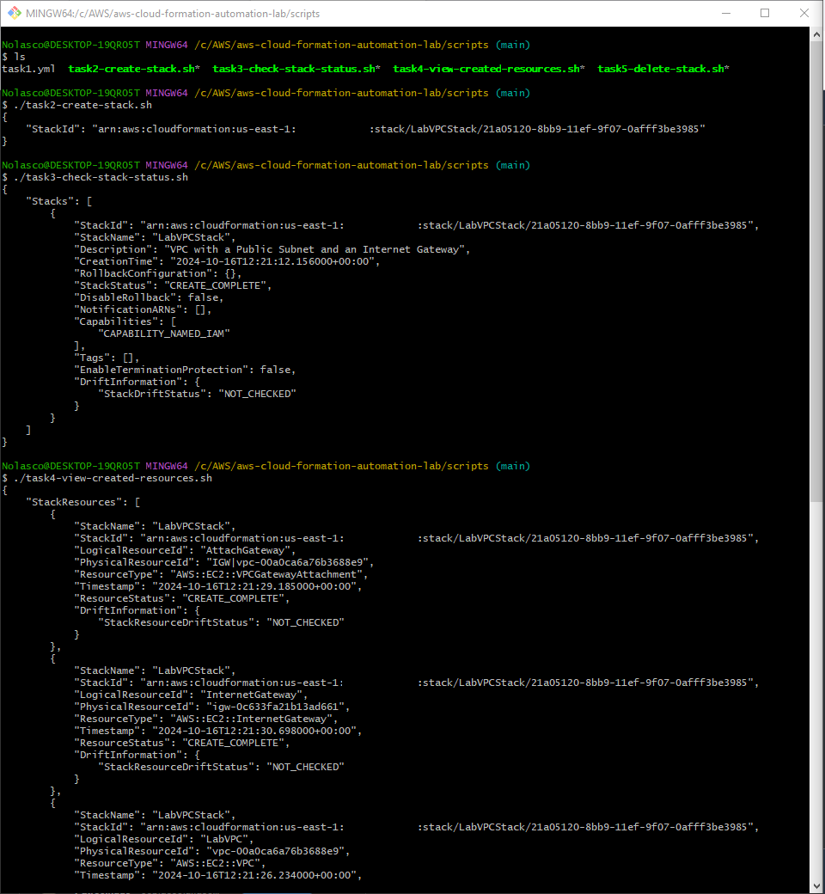
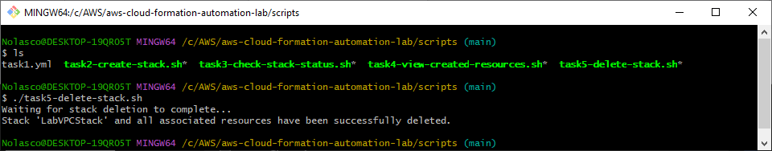

## Overview
You can execute these scripts as an alternative to manual resource creation in the AWS Management Console. 

## Execution Order

Please run the scripts in the following order:
- Edit the scripts according to your needs before running them

1. **Create the YAML Template**
- This file has already been created as task1.yml

---

2. **Create the Stack**
```bash
./task2-create-stack.sh
```

---

3. **Check Stack Status**
```bash
./task3-check-stack-status.sh
```

---

4. **View Created Resources**
```bash
./task4-view-created-resources.sh
```

---

5. **Deleting the Stack**
```bash
./task5-delete-stack.sh
```

---

<div align="center">
  
</div>

<div align="center">
  
</div>

